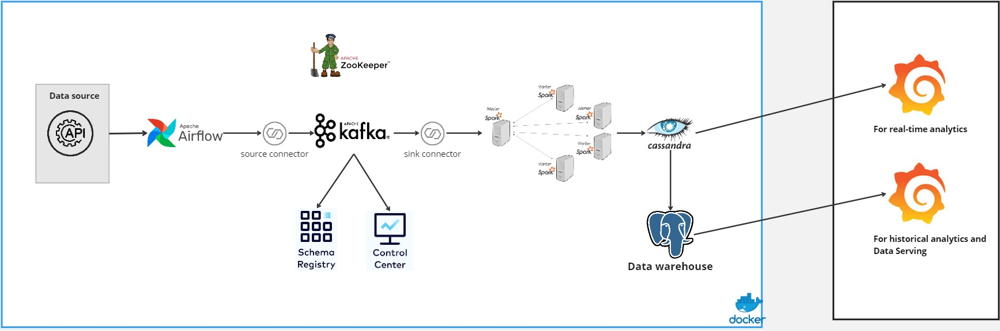

# Realtime Data Streaming 

## Table of Contents
- [Introduction](#introduction)
- [System Architecture](#system-architecture)
- [Technologies](#technologies)
- [Getting Started](#getting-started)
- [Data Overview](#data-overview)

## Introduction

This project is about building an near real-time data pipeline. This project is focused on developing an application that can perform real-time analysis of the weather conditions
## System Architecture



The project is designed with the following components:

- **Data Source**: [Weather API](https://www.weatherapi.com/)
- **Apache Airflow**: Responsible for orchestrating the pipeline and storing fetched data in a PostgreSQL database.
- **PostgreSQL**: Store metadata of Airflow, and use as a data warehouse.
- **Apache Kafka**: Used for streaming data from Cassandra to the processing engine.
- **Apache Spark**: For data processing with its master and worker nodes.
- **Cassandra**:  Where the processed data will be stored
- **Docker**: Used to containerize the services.
- **Grafana**: For visualization of the data.


## Technologies
- Python **X** Apache Spark
- Apache Airflow
- Apache Kafka
- Apache Zookeeper
- Cassandra
- Postgresql
- Docker


## Getting Started

### Start pipeline and dashboard

1. Run Docker Compose to spin up the services:
    ```bash
    docker-compose up -d
    ```

2. Access airflow webserver UI (http://localhost:8080/) to start the job 


3. Run spark-job 
  - `<spark-master container id>`: get it in docker
  - `<spark master IP address>`: get it on the spark UI

    ```bash
      docker exec -it <spark-master container id>\
      spark-submit --master spark://<spark master IP address>:7077 \
      --packages com.datastax.spark:spark-cassandra-connector_2.12:3.4.1,\
      org.apache.spark:spark-sql-kafka-0-10_2.12:3.4.1 spark_stream.py
    ```

    or if already have spark in machine use:

    ```bash
    python spark_stream.py
    ```
    
  ## Data Overview

### Raw data from the Weather API looks like this:

<b><span style="color:Aqua">
NOT AVAILABLE
</span></b>

### And here is the data schema after processing:

- Location data will contain the following fields:
    - name: name of the city
    - region: region of the city
    - country: country of the city
    - lat: latitute of the city
    - lon: longitude of the city
    - tz_id: timezone of the city
    - localtime: local time of the city
    - localtime_epoch: local time epoch of the city

- Day data will contain the following fields:
    - date: last updated date
    - date_epoch: last updated date in epoch format
    - maxtemp_c: Maximum temperature in celsius
    - mintemp_c: Minimum temperature in celsius
    - avgtemp_c: Average temperature in celsius
    - maxwind_kph: Maximum wind speed in kph
    - totalprecip_mm: Total precipitation in mm
    - totalsnow_cm: Total snow in cm
    - avghumidity: Average humidity
    - daily_will_it_rain: 
    - daily_chance_of_rain:
    - daily_will_it_snow:
    - daily_chance_of_snow:
    - condition_text: 
    - condition_icon:
    - condition_code:
    - uv: UV index of the day


- Hour data will contain the following fields:
    - id: id of the record in UUID format
    - time: time in format yyyy-mm-dd hh:mm
    - temp_c: Temperature in celsius at that hour
    - is_day: 
    - condition_text: The word description of the weather condition
    - condition_icon: The icon code of the weather condition
    - condition_code: The code of the weather condition
    - wind_kph: Wind speed in kph
    - wind_degree: Wind degree
    - pressure_mb: Pressure in millibars
    - pressure_in:
    - precip_mm:
    - precip_in:
    - snow_cm:
    - humidity:
    - cloud:
    - feelslike_c:
    - hour_uv: UV index per hour

 


